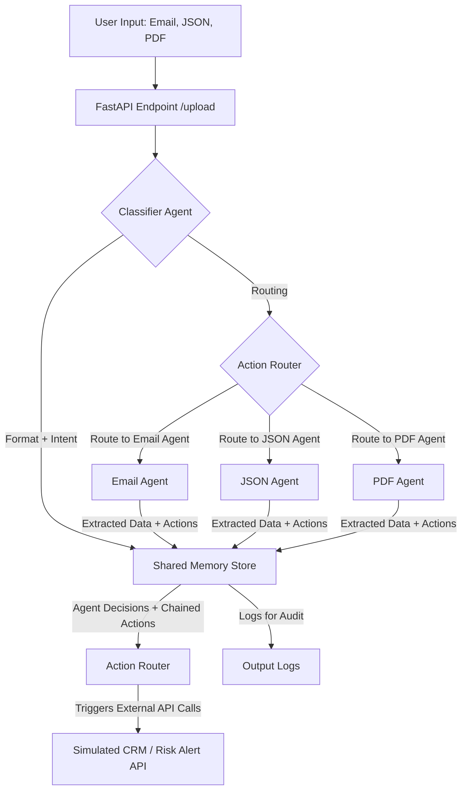

# 🚀 Multi-Format Autonomous AI System

## 📌 Objective

This project implements a *multi-agent AI system* that can:

* Accept **multiple input formats**: Email (`.eml`), JSON, and PDF.
* Automatically **classify input type** and **business intent**.
* Route data to the appropriate **specialized agent** for processing.
* Extract relevant information and **trigger follow-up actions** (e.g., external API calls).
* Maintain logs for **auditability** and traceability.


## 🧠 System Architecture




## ⚙️ Tech Stack

| Area               | Technology                              |
| ------------------ | --------------------------------------- |
| Language           | Python                                  |
| Web Framework      | FastAPI                                 |
| PDF Parsing        | PyPDF2                                  |
| JSON Processing    | Pydantic, orjson                        |
| Email Parsing      | `email` module, `mailparser` (optional) |
| Shared Memory      | SQLite + runtime in-memory dictionary   |
| LLM Integration    | Google Gemini via `google-generativeai` |
| UI Templating      | Jinja2                                  |
| Web Server         | Uvicorn                                 |
| Retry Logic        | Tenacity                                |
| Sample Data        | Faker                                   |
| Environment Config | python-dotenv                           |
| Containerization   | Docker                                  |


## 📁 Project Structure

```
multi_format_ai/
│
├── main.py                         # Entry point for FastAPI app
├── requirements.txt                # Python dependencies
├── shared_memory.py               # In-memory + persistent data store
├── test_api.py                    # API test cases
├── Dockerfile                     # Docker container configuration
├── README.md                      # This file
│
├── agents/                        # Modular AI agents
│   ├── base_agent.py
│   ├── classifier_agent_gemini.py
│   ├── email_agent_gemini.py
│   ├── json_agent.py
│   ├── pdf_agent.py
│   ├── action_router.py
│   └── gemini_utils.py
│
├── sample_inputs/                 # Input examples for testing
│   ├── email_sample.eml
│   ├── json_sample_fraud.json
│   ├── pdf_invoice_sample.pdf
│   └── pdf_regulation_sample.pdf
│
├── templates/                     # HTML templates for UI
│   └── index.html
│
└── venv/                          # Python virtual environment
```


## 🧪 Sample Inputs

Located in the `sample_inputs/` folder:

* `email_sample.eml` – Simulated email input.
* `json_sample_fraud.json` – Synthetic JSON with fraud-related fields.
* `pdf_invoice_sample.pdf` – Invoice document.
* `pdf_regulation_sample.pdf` – Regulatory document.


## 🧰 How to Run

### 🔧 Prerequisites

* Python 3.8+
* [Docker](https://www.docker.com/) (optional, for containerized run)


### 💻 Local Setup

```bash
# Clone the repository
git clone https://github.com/your-org/multi-format-ai.git
cd multi-format-ai

# Create virtual environment
python -m venv venv
source venv/bin/activate  # or venv\Scripts\activate on Windows

# Install dependencies
pip install -r requirements.txt

# Run the app
uvicorn main:app --reload
```

Access the UI at: [http://127.0.0.1:8000](http://127.0.0.1:8000)


### 🐳 Docker Setup

```bash
# Build the Docker image
docker build -t multi-format-ai .

# Run the container
docker run -p 8000:8000 multi-format-ai
```


## 🌟 Bonus Features

### ✅ Resilient Retry Logic

Implemented via the `tenacity` library within `action_router.py`:

* Retries up to 3 times with exponential backoff (1s, 2s, 4s).
* Targets network-related exceptions like `httpx.TimeoutException`, `ConnectError`, etc.


### ✅ Interactive Web UI

* Built using **Jinja2** templates.
* Upload `.eml`, `.json`, or `.pdf` files from browser.
* View classification results and routing paths.


### ✅ Fully Dockerized

* The system includes a **Dockerfile** for easy deployment.
* Supports consistent execution across different environments.


## 🧪 Running Tests

```bash
pytest test_api.py
```


## 🔮 Future Work

* Add authentication and role-based access controls.
* Expand to support DOCX, XLSX, and image OCR.
* Real-time socket-based update streaming in UI.
* Logging dashboard with analytics.


## 👨‍💻 Contributors

We welcome contributions! Feel free to fork, improve, or submit issues.


